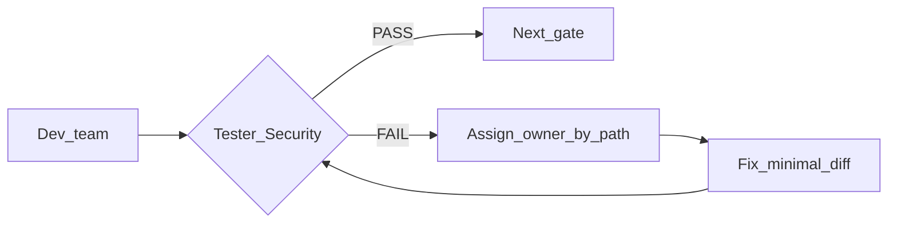

# Workflow: Feedback Loop & Parallel Execution (공통)

모든 workflow(feature, bugfix)에 **필수 적용**.
Coordinator gateway가 `@` 없이도 본 규칙으로 sub-agent를 **지시·실행·재루프**한다.

---

## 1. @ 없이 Coordinator가 sub-agent를 지시하는 방식

| 사용자 | Coordinator 동작 |
|--------|------------------|
| `@co` / `@backend` 등 **언급 없음** | gateway가 workflow 선택 → 계획에 팀 할당 → **같은 세션에서 해당 역할로 바로 실행** |
| `@co` 명시 | 위 + 추가 확인 |

- 계획의 `@backend`, `@tester` 등은 **@멘션이 아니라 역할 라벨**.
- Coordinator는 역할별로 **PROMPT FORMULA**(역할·맥락·과제·제약·형식)를 작성한 뒤 **Context(agent md + scoped rules)** 를 적용하며 작업한다.
- Spec: [prompt-formula.md](./prompt-formula.md)
- 사용자에게 "다시 @xxx 호출하세요"로 **미루지 않는다** — 같은 세션에서 fix loop까지 진행.

---

## 2. 병렬 실행

| 구간 | 병렬 대상 | 선행 조건 |
|------|-----------|-----------|
| 구현 | `@backend` ∥ `@frontend` | 쿼리/응답 스키마 확정 (`@dba` 산출) |
| 검증 | `@tester` 정적 → 동적 (순차, static PASS 후 dynamic) | — |

**병렬 불가**: `@dba` 쿼리 설계 → 구현 순서 (스키마 없이 FE/BE 동시 시작 금지).

---

## 3. 피드백 루프 (Fix-until-PASS)

이슈 1건이라도 있으면 **즉시 담당 dev에게 조치** → **해당 게이트 재실행**. 전체 파이프라인 처음부터 돌리지 않는다.

### 3.1 담당자 매핑 (경로)

| 변경 경로 | Fix 담당 |
|-----------|----------|
| `app/db/**`, `app/storage/**` | `@dba` (쿼리) → `@backend` (연결) |
| `app/main.py`, `app/config.py`, `app/collectors/**` | `@backend` |
| `app/templates/**`, `app/static/**` | `@frontend` |
| `.env*`, 크리덴셜 | `@security` |

### 3.2 Tester

| 발견 | 즉시 조치 | 재실행 |
|------|-----------|--------|
| 라이선스 경계 위반(AWR/ASH 등) | `@dba` — 쿼리 교체 | `@tester` static only |
| pytest fail | 담당 팀 | `@tester` dynamic only |
| 접속 스모크 테스트 fail | `@backend`/`@dba` (DSN/권한 문제 구분) | `test_connection.py` 재실행 |

### 3.3 Security

| 발견 | 즉시 조치 | 재실행 |
|------|-----------|--------|
| 크리덴셜 노출, SQL concat, 쓰기 작업 무승인 | `@backend`/`@dba` | `@security` |

---

## 4. Coordinator 세션 내 실행 순서

1. 계획 출력 (병렬·피드백 루프 포함)
2. **첫 gate부터 실행** — 계획만 출력하고 멈추지 않음
3. Gate FAIL → **Fix loop**(섹션 3) → PASS까지
4. 다음 gate 진행
5. 전 gate PASS → worklog
6. 응답 말미 `## 요약` 권장

---

## 5. 완료 조건

- 모든 relevant gate **PASS**
- 또는 사용자가 명시적으로 scope 축소·중단
- 미해결 → `docs/worklog/REWORK.md`에 등록
